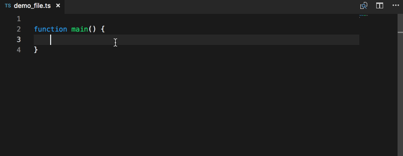

# typescript-namespace-imports-vscode-plugin README

A plugin that makes it easier to 
automatically include namespace imports.

A [namespace import](http://exploringjs.com/es6/ch_modules.html#_importing-styles) is an import like:
```
import * as ModuleName from "path/to/module_name"
```

## Features

This plugin offers the capital-cased version of every typescript file in your workspace as a module inside of autocomplete.

For example if the file file_to_import exists in your
workspace it will offer to import it as a module called
FileToImport.
Describe specific features of your extension including screenshots of your extension in action. Image paths are relative to this README file.



## Extension Settings

None yet.

## Known Issues

Imports are currently imported using the workspace relative path.

This will need to be improved in the future to support imports
relative to the current file or to respect the value of `compilerOptions.baseUrl` provided in tsconfig.

## Release Notes

### 0.0.1

Initial release.
